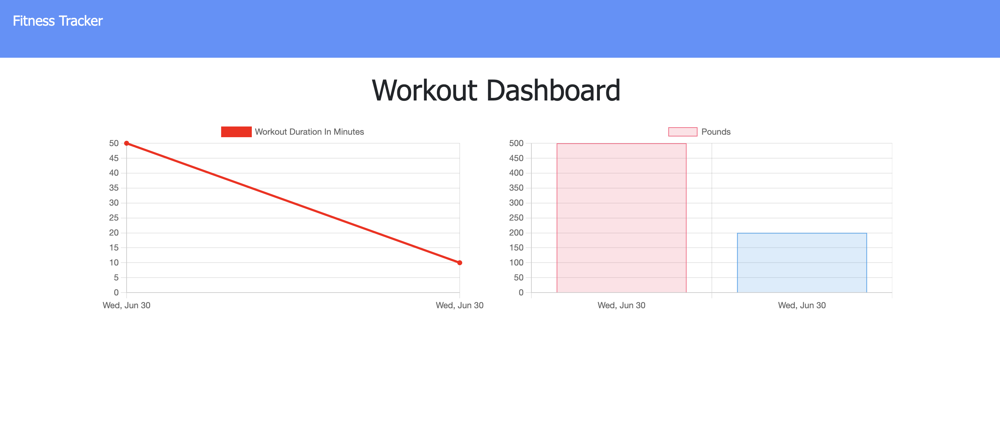
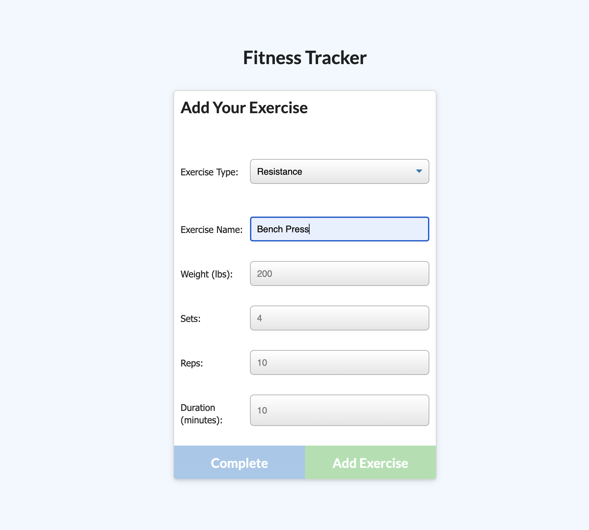

# Workout Tracker: NoSQL

## Description
Utilized front end starter code and created a Mongo database with a Mongoose schema and handle routes with Express, to allow users to view, create and track daily workouts. Users are able to log multiple exercises in a workout on a given day, and track the name, weight, sets, reps, duration of exercise and distance traveled if the exercise is cardio. 

## Table of Contents
* [Installation](#installation)
* [Usage](#usage)
* [License](#license)
* [Tests](#tests)
* [Contributors](#contributors)
* [Questions](#questions)

## Installation
To install run the following command: Currently no installation available, but the app can be accessed via heroku. 

## Usage
App can be accessed via heroku. [Deployed Heroku application](https://dry-sierra-05814.herokuapp.com/)

## License 
    
    This project is licensed under MIT license.

## Tests
To run test run the following command: no tests associated

## Contributors
These people helped complete this project: Morgan Splawn (Tutor)

## Questions
For any questions reach out to me via the following methods: 
* Github: [childishmartino](https://github.com/childishmartino)
* Email: [chrisg1821@gmail.com](mailto:chrisg1821@gmail.com)
* LinkedIn: [chris-garcia-30248435](https://www.linkedin.com/in/chris-garcia-30248435/)

